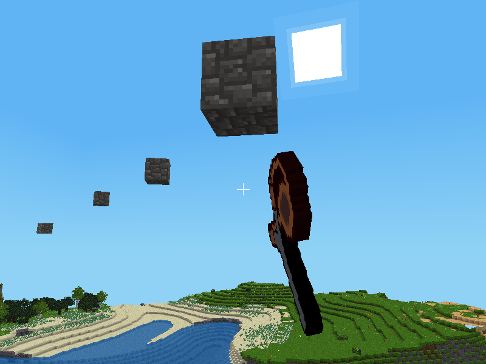

## Slingshot for Minetest

### Description:

Adds slingshots that can throw inventory items as ammunition.

The original code was extracted from [hook](https://forum.minetest.net/viewtopic.php?t=13634) mod by [AiTechEye](https://forum.minetest.net/memberlist.php?mode=viewprofile&u=16172).



### Licensing:

- Code
	- Original code by AiTechEye: CC0
	- Code by Jordan Irwin (AntumDeluge): [MIT](LICENSE.txt)
- Textures:
	- Orignals by AiTechEye: CC BY-SA 4.0
	- New: CC0

### Requirements:

- Minimum Minetest version: 5.0.0
- Depends: none
- Optional depends:
	- [default](https://github.com/minetest/minetest_game/tree/master/mods/default) (required for craft recipe)
	- [technic](https://content.minetest.net/packages/RealBadAngel/technic/) (changes craft recipes to use rubber band)
	- [xdecor](https://content.minetest.net/packages/jp/xdecor/) (workbench can be used to repair slingshots)
	- [workbench](https://github.com/AntumMT/mod-xdecor/tree/workbench) (can be used to repair slingshots)

### Usage:

- *Left-click*: Throws items from slot right of slingshot.

#### Crafting:

<details><summary>Spoiler</summary>

**Legend:**

* `SI` = default:steel_ingot
* `ST` = default:stick
* `RB` = slingshot:rubber_band
* `TR` = technic:rubber
* `TL` = technic:raw_latex

**Recipes:**

wooden slingshot:

    ╔════╦════╦════╗
    ║ ST ║    ║ ST ║
    ╠════╬════╬════╣
    ║    ║ ST ║    ║
    ╠════╬════╬════╣
    ║    ║ ST ║    ║
    ╚════╩════╩════╝

wooden slingshot (rubber band required with technic):

    ╔════╦════╦════╗
    ║ ST ║ RB ║ ST ║
    ╠════╬════╬════╣
    ║    ║ ST ║    ║
    ╠════╬════╬════╣
    ║    ║ ST ║    ║
    ╚════╩════╩════╝

iron slingshot:

    ╔════╦════╦════╗
    ║ SI ║    ║ SI ║
    ╠════╬════╬════╣
    ║    ║ SI ║    ║
    ╠════╬════╬════╣
    ║    ║ SI ║    ║
    ╚════╩════╩════╝

iron slingshot (rubber band required with technic):

    ╔════╦════╦════╗
    ║ SI ║ RB ║ SI ║
    ╠════╬════╬════╣
    ║    ║ SI ║    ║
    ╠════╬════╬════╣
    ║    ║ SI ║    ║
    ╚════╩════╩════╝

rubber band:

    ╔════╦════╦════╗
    ║ TL ║ TL ║    ║
    ╠════╬════╬════╣
    ║ TL ║    ║ TL ║
    ╠════╬════╬════╣
    ║    ║ TL ║ TL ║
    ╚════╩════╩════╝

rubber band (shapeless):

    ╔════╗
    ║ TR ║
    ╚════╝

</details>

#### Settings:

```
slingshot.old_textures
	- Use old 16x16 textures.
	- type:    bool
	- default: false

slingshot.ammos
	- Value of these items will be added to slingshot attack when thrown.
	- type:    string (comma-separated key=value list)
	- default: default:mese_crystal=5
```


### Links:

- [](https://content.minetest.net/packages/AntumDeluge/slingshot/)
- [Forum](https://forum.minetest.net/viewtopic.php?t=18315)
- [Git repo](https://github.com/AntumMT/mod-slingshot)
- [API](https://antummt.github.io/mod-slingshot/docs/api.html)
- [Changelog](changelog.txt)
- [TODO](TODO.txt)
